# Enterprise Windows Active Directory Lab with Local DNS/DHCP, Group Policies & Software Deployment

> This project builds a self-contained enterprise Windows domain from scratch. A single domain controller handles DNS, DHCP, and internet routing for an isolated client network, while Active Directory manages user identity, departmental file permissions, and security policy. It shows how a real organization centrally manages and enforces its network services, user access, and endpoint configuration; all from one domain controller.

---

## System Architecture

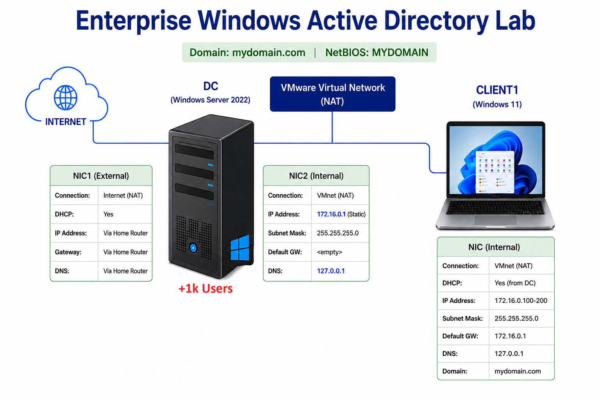

*Figure 1. Lab topology — the domain controller runs two NICs (one for internet access, one as the gateway/DNS/DHCP source for the isolated client network), while the client VM connects through a single host-only NIC.*

---

## Technologies & Security Tools

- Windows Server (Domain Controller)
- Windows 11 (Domain Client)
- Active Directory Domain Services (AD DS)
- DNS Server
- DHCP Server
- Routing and Remote Access (RAS/NAT)
- Group Policy Management Console (GPMC)
- PowerShell
- NTFS / Share Permissions

---

## Objectives

- Deploy a dual-NIC Windows Server domain controller and Windows 11 client in an isolated lab network.
- Install Active Directory Domain Services and stand up a new forest, with OU structure and a dedicated domain admin account.
- Configure DHCP and RAS/NAT so the client network receives addressing and routes internet traffic through the domain controller.
- Enforce departmental access control through security groups, NTFS permissions, and domain-wide password/lockout policy via Group Policy.
- Automate software deployment through GPO, then diagnose and resolve a real-world permissions failure between Domain Users and Domain Computers.

## Lab Walkthrough

### Step 1: Network Foundation & Domain Controller Setup

The domain controller was built with two NICs — one for internet access and one to serve as the gateway, DNS, and eventual DHCP source for the isolated client network.

#### Dual-NIC Network Design

The domain controller uses two separate NICs: one for internet connectivity, and one to act as the gateway for the client network, effectively creating an isolated local network for domain resources.

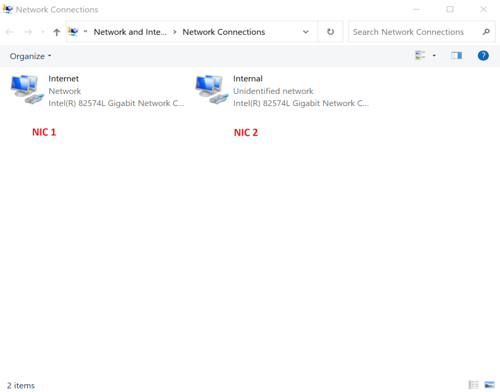

*Figure 2. Dual-NIC configuration — internet-facing NIC and client-network gateway NIC.*

#### Static IP & DNS Configuration

The DC was assigned a static IP address and configured to use its own loopback address as the DNS server, making it authoritative for the client network's name resolution.

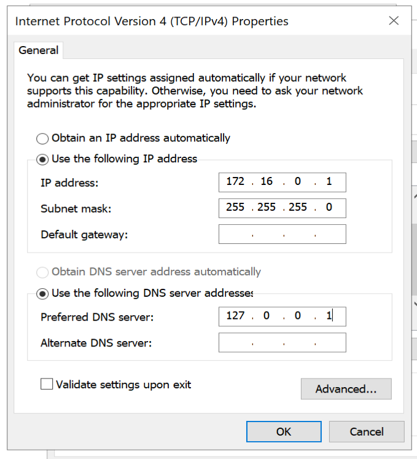

*Figure 3. IPv4 configuration with static addressing and loopback DNS.*

#### Active Directory Domain Services Installation

AD DS was installed on the DC as the first step toward standing up the domain.

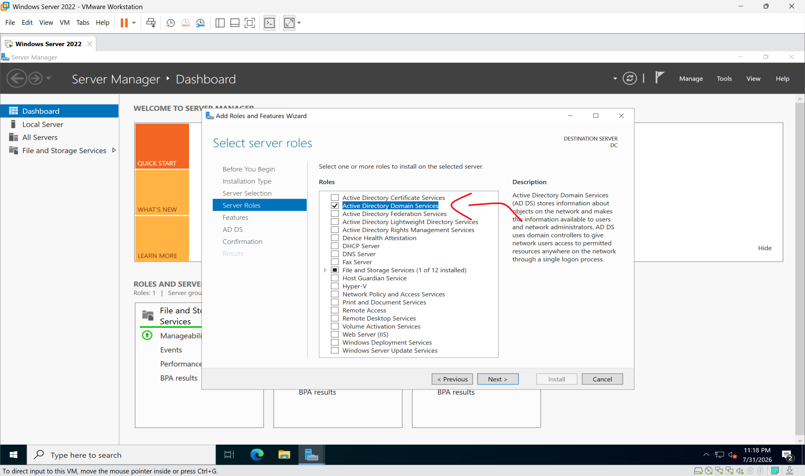

*Figure 4. Active Directory Domain Services role installation.*

#### Forest & Domain Deployment

A new forest was created with the FQDN `mydomain.com`, promoting the server to domain controller for the environment.

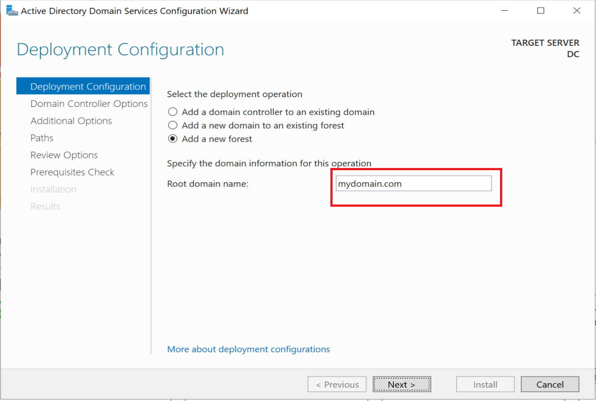

*Figure 5. New forest deployment for mydomain.com.*

#### Organizational Unit & Domain Admin Provisioning

An `_ADMINS` OU was created in Active Directory Users and Computers, and a dedicated domain admin account (`a-mhuzaifah`) was added — separating administrative identity from standard user access.

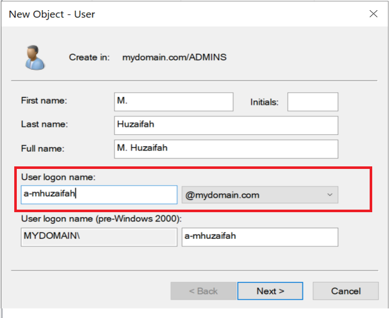

*Figure 6. `_ADMINS` OU with a dedicated domain admin account added to Domain Admins.*

---

### Step 2: Client Internet Access & DHCP

Rather than letting the client network reach the internet directly, all outbound traffic is routed through the DC — giving full visibility and control over client connectivity.

#### RAS/NAT Deployment

Routing and Remote Access was installed on the DC so the client network's internet traffic passes through it, rather than reaching the internet independently.

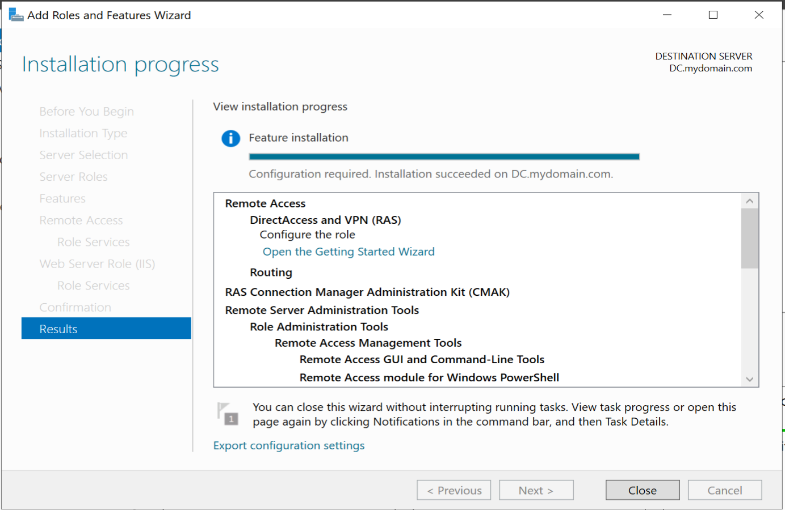

*Figure 7. RAS/NAT installation on the domain controller.*

#### Residential Gateway Configuration

The residential gateway IP address was selected as the upstream connection for outbound internet traffic.

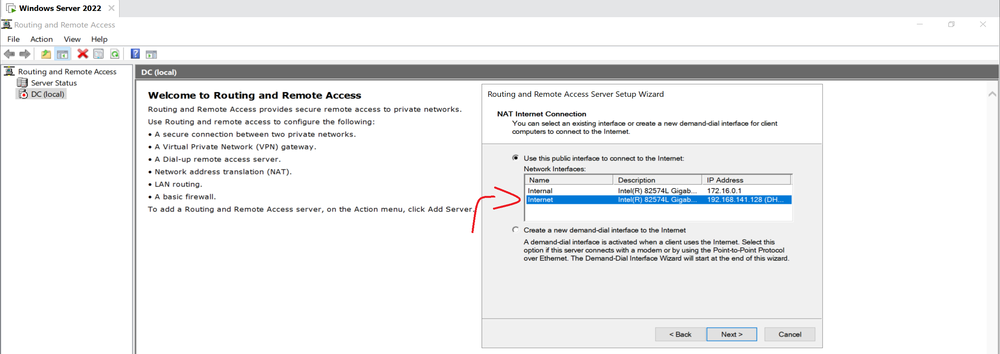

*Figure 8. Residential gateway selection for internet routing.*

#### DHCP Server Deployment

DHCP was installed on the domain controller to automatically assign IP configuration to the client network.

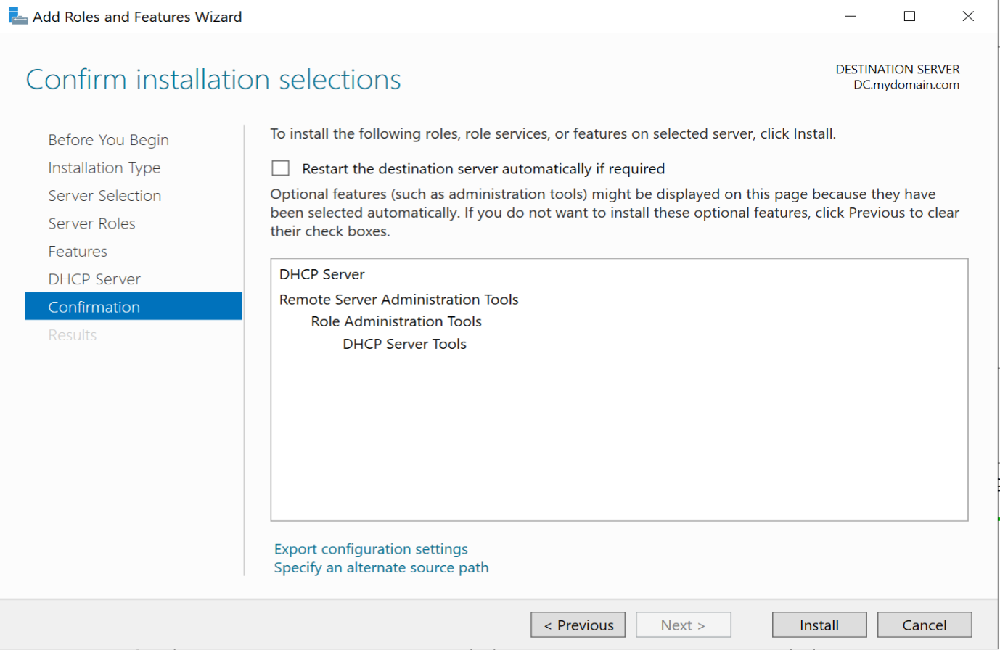

*Figure 9. DHCP server role installation on the DC.*

#### DHCP Scope Configuration

The DHCP scope was set to `172.16.0.100–200`, providing 100 available addresses with a 2-day lease — a reasonable interval for a home lab, though shorter than what would be used in a public-facing environment.

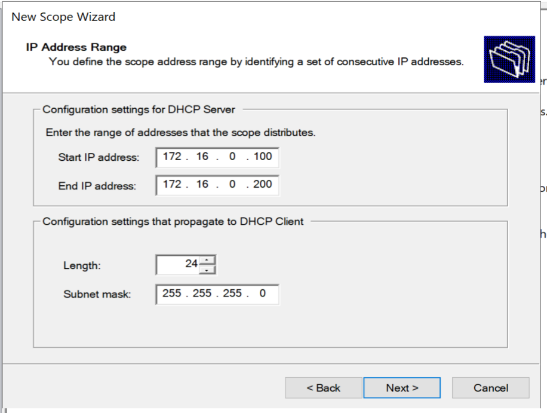

*Figure 10. DHCP scope range and lease duration configuration.*

---

### Step 3: Bulk User Provisioning & Domain Join

With core infrastructure in place, the domain was populated with users and the client machine was joined.

#### Bulk User Creation via PowerShell

A PowerShell script was used to bulk-create 1,000 domain user accounts with a standard initial password.

```powershell
# Bulk AD user creation script
# Credit: Josh Madakor — https://github.com/joshmadakor1/AD_PS
```

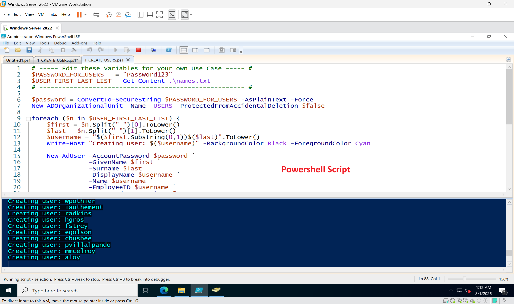

*Figure 11. PowerShell script generating domain user accounts.*

The script populated the `_USERS` OU with over 1,000 accounts, alongside the local domain admin.

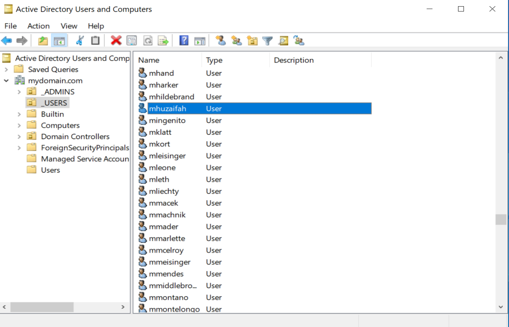

*Figure 12. `_USERS` OU populated with bulk-created accounts.*

#### Client Domain Join & Connectivity Verification

The Windows 11 client received its IP address (`172.16.0.1`) from the DHCP server automatically, then was joined to the domain using domain user credentials.

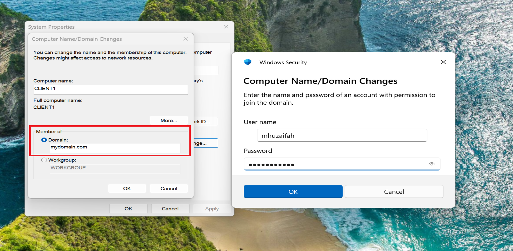

*Figure 13. Client VM receiving a DHCP lease and joining the domain.*

Domain and internet connectivity were confirmed by pinging both the local domain and `8.8.8.8`, verifying that DNS resolution and RAS-routed internet access both worked as intended.

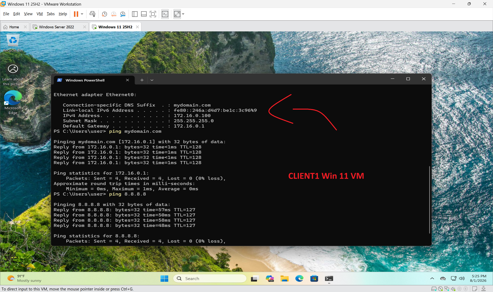

*Figure 14. Connectivity verification — local domain resolution and internet reachability via RAS.*

---

### Step 4: Security Groups & File Share Permissions

Departmental access boundaries were enforced using AD security groups and NTFS permissions.

#### Security Group Creation

Three security groups were created under a `Groups` OU, each populated with its respective department's members.

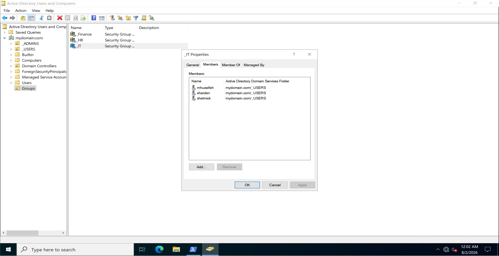

*Figure 15. Departmental security groups created under the Groups OU.*

#### Departmental Shared Folder Structure

A `Shared by DC` folder was created containing three departmental subfolders, each restricted to its corresponding security group with Read/Write permissions — preventing cross-department access (e.g., IT cannot view HR or Finance).

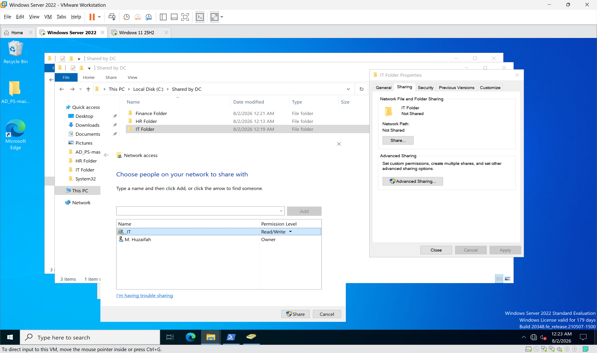

*Figure 16. Departmental shared folders with group-based Read/Write permissions.*

#### Access Control Verification — Negative Test

User `mhuzaifah`, a member of the `_IT` group, was confirmed unable to access the Finance department folder over the network.

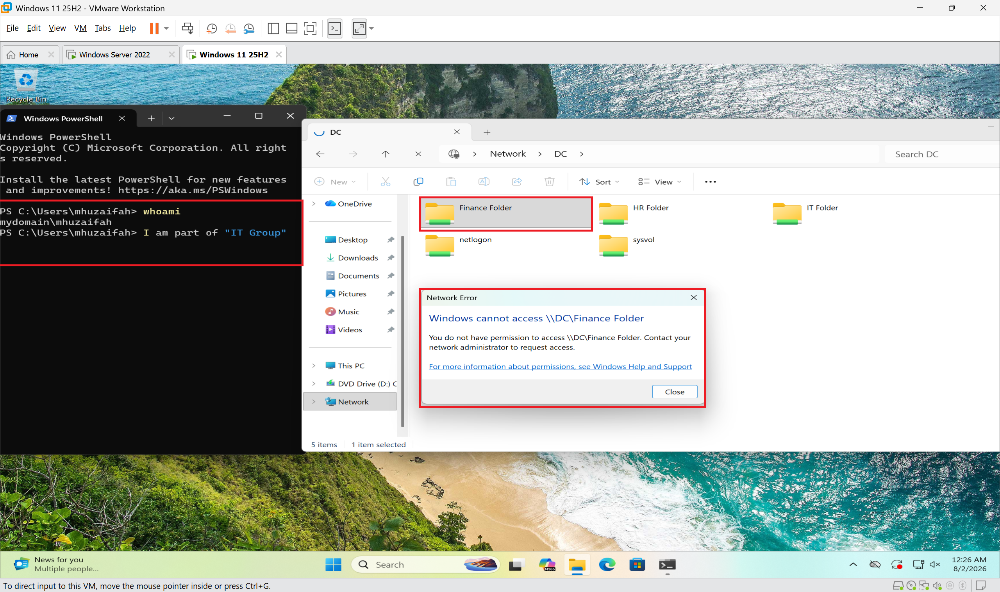

*Figure 17. Access denied to Finance folder for a non-member user.*

#### Access Control Verification — Positive Test

The same user was confirmed able to access and modify files within the IT department folder, matching their group membership.

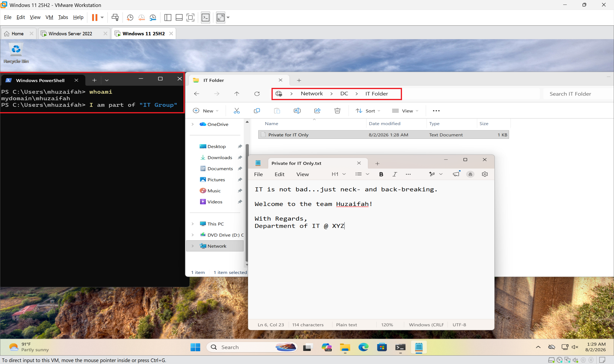

*Figure 18. Successful read/write access to the IT department folder.*

---

### Step 5: Group Policy — Account & Password Security

With Part 1's infrastructure complete, Part 2 focused on Group Policy–driven security enforcement and software deployment.

#### Domain-Wide Password & Lockout Policy

The Default Domain Policy was edited to enforce a 12-character minimum password length and an account lockout policy (5 attempts, 10-minute lockout duration, 10-minute reset window). Editing the Default Domain Policy — rather than a separate GPO — ensures these account policies apply domain-wide rather than to a subset of users.

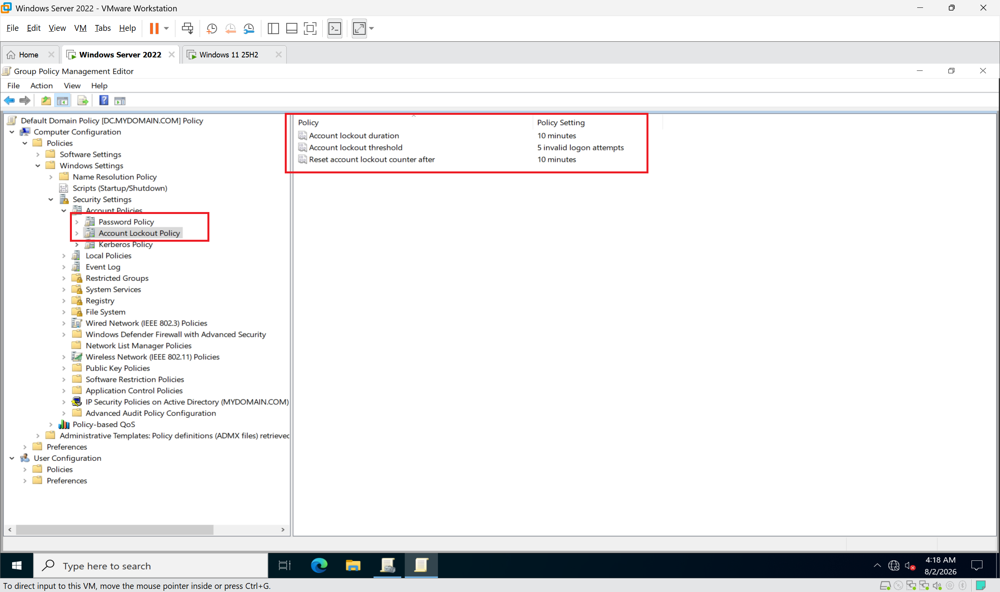

*Figure 19. Default Domain Policy password and account lockout settings.*

#### Lockout Policy Verification

The lockout policy was validated in practice, confirming the configured 10-minute delay took effect after repeated failed logon attempts.

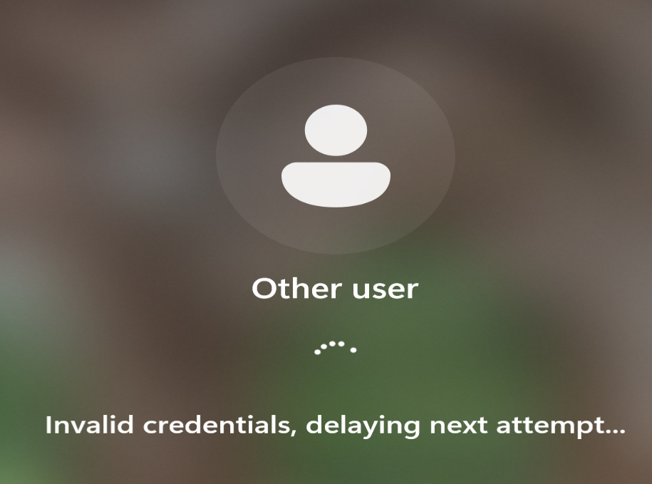

*Figure 20. Account lockout enforced after failed authentication attempts.*

---

### Step 6: Group Policy — Targeted User & Computer Configuration

To separate policies that target users from those that target machines, dedicated OUs were created for each.

#### OU Structure for Targeted GPOs

Two OUs — `_USERS` and `_COMPUTERS` — were created in Group Policy Management for `mydomain.com`, housing policies scoped to their respective object types. Control Panel and PC settings access was enabled as part of this structure.

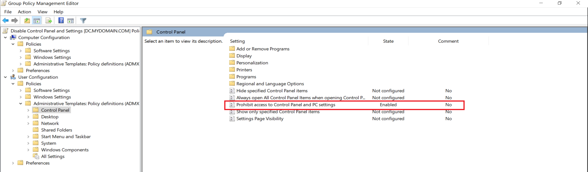

*Figure 21. `_USERS` and `_COMPUTERS` OUs for targeted Group Policy scoping.*

#### Control Panel Restriction GPO

A GPO restricting Control Panel access was applied under `_USERS`. The client machine displayed the expected restriction message when attempting to open Control Panel.

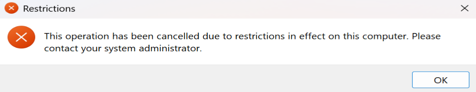

*Figure 22. Control Panel access restriction enforced on the client.*

#### Default Wallpaper Deployment GPO

A default wallpaper GPO was configured under `_USERS`, pointing to a shared image path (`\\DC\MISC\wallpaper.jpg`) that the client must be able to reach for the policy to apply successfully.

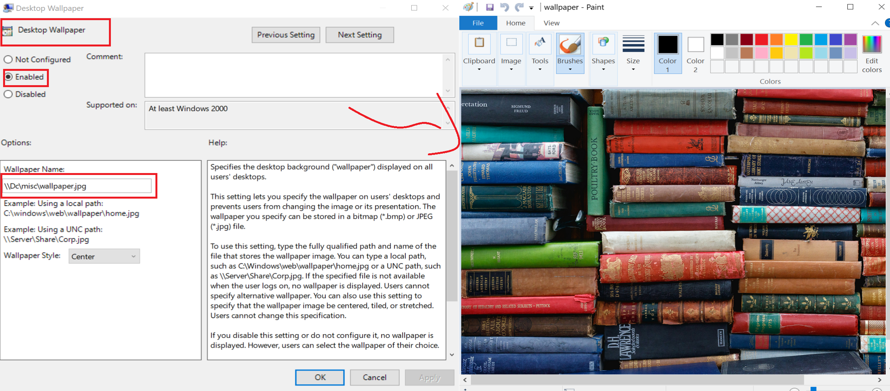

*Figure 23. Default wallpaper GPO configuration under the `_USERS` OU.*

#### Wallpaper GPO Verification

The policy applied successfully, with the Windows 11 client's desktop wallpaper updated to match the configured default.


*Figure 24. Client desktop reflecting the GPO-deployed wallpaper.*

#### Domain Firewall Enforcement GPO

A GPO enforcing Windows Firewall across all profiles was applied under `_COMPUTERS`, ensuring the firewall stays enabled on `CLIENT1` regardless of which user or admin is signed in.

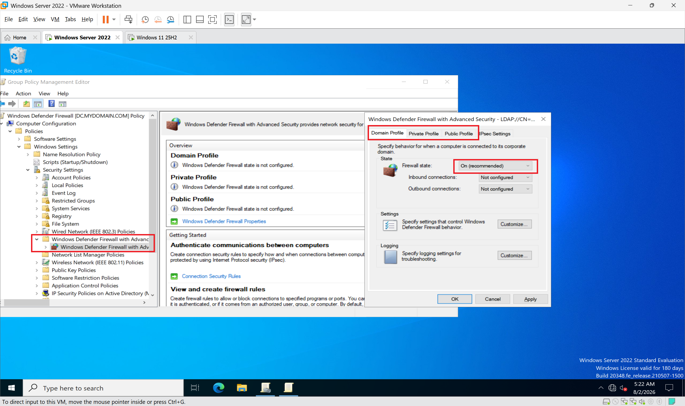

*Figure 25. Firewall enforcement GPO applied at the computer level.*

---

### Step 7: Automated Software Deployment & Troubleshooting

The final phase deployed software automatically to the client at logon — and surfaced a real troubleshooting scenario along the way.

#### Software Installation GPO

A software installation GPO was configured under `_COMPUTERS` to deploy Notepad++ and VLC Media Player automatically at logon, using two MSI packages referenced by the policy.

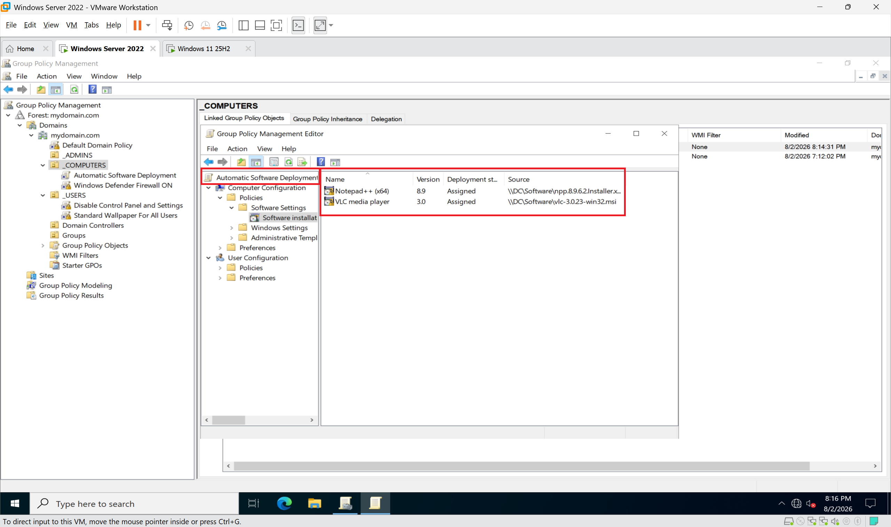

*Figure 26. Software installation GPO referencing Notepad++ and VLC MSI packages.*

#### Troubleshooting a Failed Deployment

The `gpresult` report revealed the software failed to install at logon. This error persisted for roughly three hours — restarts, UNC path verification, and `gpupdate /force` all failed to resolve it.

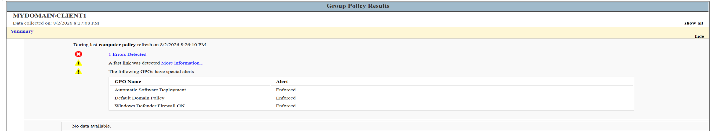

*Figure 27. `gpresult` report showing failed software installation.*

#### Root Cause & Resolution

The root cause was an NTFS permissions gap: Domain Users had read access to the folder hosting the MSI files, but Domain Computers did not — and since this is a computer-targeted installation, it's the computer account, not the signed-in user, that needs access. The fix was to remove read access for Domain Users and grant it to Domain Computers instead.

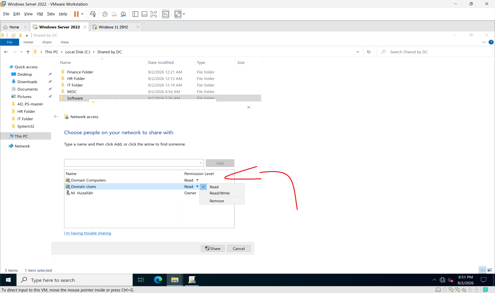

*Figure 28. NTFS permissions corrected — Domain Computers granted read access, Domain Users' access removed.*

#### Verification

With the permissions corrected, both Notepad++ and VLC installed successfully on `CLIENT1` at next logon.

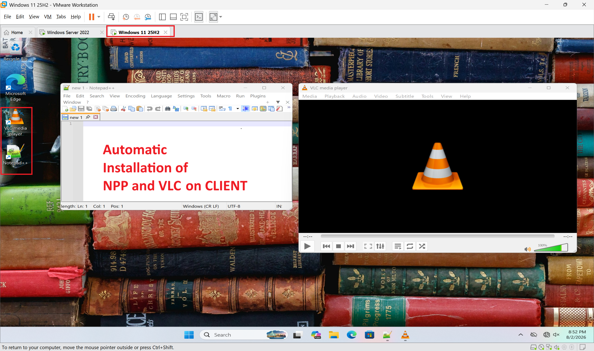

*Figure 29. Notepad++ and VLC successfully installed on the client via GPO.*

---

## Conclusion

This lab replicates the core of how an enterprise Windows environment is built and managed — from network segmentation and domain controller deployment through Active Directory structure, departmental access control, and Group Policy enforcement. The software deployment troubleshooting in particular reflects a real-world scenario: a policy that applies correctly on paper but fails silently until the underlying permissions model — user vs. computer identity — is properly understood.

---

## Disclaimer

This project was completed in an isolated lab environment for educational purposes.
